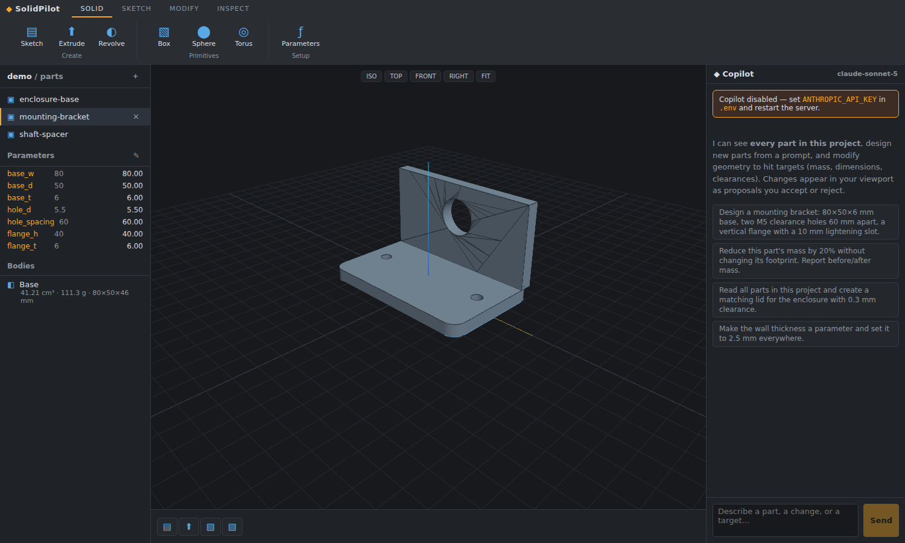

# ◆ SolidPilot — Cursor for CAD

**An AI-native parametric CAD workspace.** Its own CAD engine in the browser, a Fusion 360-style
ribbon, and an embedded AI copilot that has context on **every part in your project** — it designs
new parts from a prompt, modifies existing geometry to hit numeric targets (mass, dimensions,
clearances), and streams every change into your viewport as a **proposal you accept or reject**,
exactly like reviewing an AI edit in Cursor.



## Why

Software got Cursor. Mechanical design didn't. CAD models are still built click-by-click, and no
mainstream tool treats a *project of parts* the way an IDE treats a repo: as shared context an AI
can read, cross-reference, and edit. SolidPilot's bet is that **parts-as-code** (fully parametric
JSON documents) plus **an agent with project-wide context** unlocks automated CAD the same way
text-as-code unlocked automated programming. See [docs/PRODUCT.md](docs/PRODUCT.md) for the B2B
thesis and roadmap.

## What's inside

| Layer | What it does |
|---|---|
| **CAD kernel** (`src/kernel/`) | Parametric feature timeline → solid bodies. Sketches (rect / circle / slot / n-gon / polygon, holes), extrude, revolve, primitives, booleans, transform, mirror, linear & circular patterns. Expression-driven parameters (`base_w / 2 - 4`). BVH-accelerated mesh CSG (three-bvh-csg). Mass properties (volume, mass, surface area, center of mass, bbox) and binary STL export. |
| **Workspace UI** (`src/ui/`) | Fusion 360-style ribbon (Solid / Sketch / Modify / Inspect), 3D viewport (Z-up, orbit, view presets, click-to-select, click-to-draw sketching on any plane), feature timeline with edit / suppress / reorder / delete, browser panel with live parameters and mass properties. |
| **AI copilot** (`server/agent.ts`) | Agent over a local, open-source LLM served by [Ollama](https://ollama.com) (no cloud API key), with tools: `list_documents`, `read_document`, `mass_properties`, `update_document`, `create_document`. Reads the whole project folder, iterates against evaluation feedback (geometry errors + measured mass properties) until targets are met, and streams proposals to the client over SSE. |
| **Project store** (`server/projects.ts`) | A project is just a folder of `*.cad.json` files — diffable, git-friendly, reviewable. |

## Quick start

The AI copilot runs entirely on a local, open-source model via [Ollama](https://ollama.com) —
no cloud API key, no per-token cost.

```bash
# 1. Install Ollama (https://ollama.com/download), then pull a tool-calling-capable model:
ollama pull qwen2.5-coder:7b     # ~4.7GB, runs fine on CPU or a modest GPU
ollama serve                     # if it isn't already running as a background service

# 2. Install and run SolidPilot
npm install
cp .env.example .env             # defaults already point at localhost:11434
npm run dev                      # client on :5173, server on :8787
```

Open http://localhost:5173 — the `demo` project loads with three sample parts
(mounting bracket, shaft spacer, electronics enclosure).

Without Ollama running, everything works except the copilot panel (it'll tell you what to start).
Larger local models (`qwen2.5-coder:14b`, `qwen2.5:32b`) follow the tool-calling schema more
reliably on multi-step edits if you have the RAM/VRAM for them — set `OLLAMA_MODEL` in `.env`.

```bash
npm run build               # typecheck + production bundle
npm start                   # serve the built app on :8787
npx tsx scripts/check-samples.ts   # kernel smoke test (validates + measures sample parts)
```

## Try the copilot

- *"Design a mounting bracket: 80×50×6 mm base, two M5 clearance holes 60 mm apart, a vertical
  flange with a 10 mm lightening slot."*
- *"Reduce this part's mass by 20% without changing its footprint. Report before/after mass."*
- *"Read all parts in this project and create a matching lid for the enclosure with 0.3 mm clearance."*

The agent reads sibling parts to match hole patterns and interfaces, checks its own work with
`mass_properties`, fixes evaluation errors before answering, and every geometry change lands as an
accept/reject proposal previewed live in the viewport.

## Document format

Parts are plain JSON: named parameters (expressions allowed) + an ordered feature timeline.
The full schema the AI works against is in [`server/schema.ts`](server/schema.ts); samples live in
[`projects/demo/`](projects/demo/).

```jsonc
{
  "version": 1, "name": "bracket", "units": "mm",
  "material": { "name": "Aluminum 6061", "density": 2.7 },
  "parameters": [{ "name": "base_w", "expr": 80 }],
  "features": [
    { "id": "sk1", "type": "sketch", "plane": { "plane": "XY" },
      "entities": [{ "id": "e1", "kind": "rect", "cx": 0, "cy": 0, "width": "base_w", "height": 50 }] },
    { "id": "ex1", "type": "extrude", "sketch": "sk1", "distance": 6, "op": "new" }
  ]
}
```

## Architecture & roadmap

See [docs/ARCHITECTURE.md](docs/ARCHITECTURE.md). Headline items on the path to production:
swap the mesh-CSG evaluator for a true B-rep kernel (OpenCascade via WASM) behind the same document
schema, constraint-based sketches, STEP import/export, multi-user CRDT editing, and org-wide
"design system" context (fastener libraries, DFM rules) for the agent.

## Environment

| Variable | Purpose |
|---|---|
| `OLLAMA_HOST` | Ollama base URL, default `http://localhost:11434` |
| `OLLAMA_MODEL` | model tag, default `qwen2.5-coder:7b` — any Ollama model with tool-calling support works |
| `PORT` | server port, default `8787` |
| `PROJECTS_DIR` | parts storage, default `./projects` |

Prefer a hosted frontier model instead? Swap `server/agent.ts`'s `OpenAI` client for
`@anthropic-ai/sdk` (or point the same OpenAI client at any other OpenAI-compatible endpoint) —
the tool definitions, evaluation loop, and proposal streaming are provider-agnostic.
